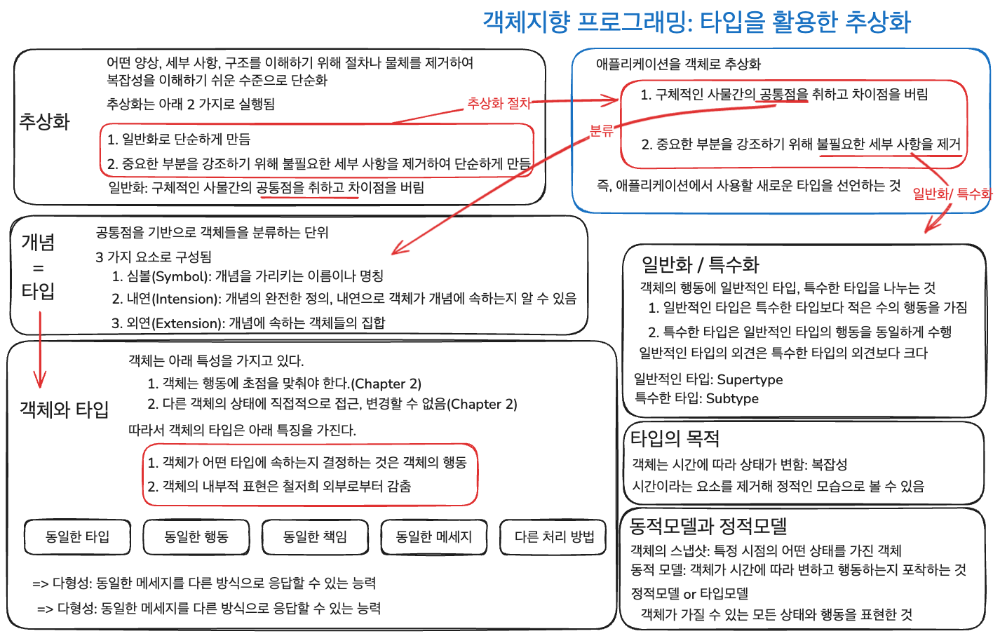

## Chapter 3. 타입과 추상화

추상화는 2 가지 절차가 있음

1. 구체적인 사물간의 공통점을 취하고 차이점을 버림

   - 분류

2. 중요한 부분을 강조하기 위해 세부 사항을 제거하여 단순하게 만듬

   - 일반화/특수화

객체지향 프로그래밍: 타입을 활용한 추상화

타입을 사용하는 이유

- 객체는 시간에 따라 상태가 변함
- 타입을 통해 시간이라는 요소를 제거하여 정적인 모습으로 복잡성을 해소

### Chapter 요약

객체지향은 타입을 사용해서 추상화를 하여 애플리케이션을 단순화한다.

분류, 일반화/특수화를 통해서 추상화를 한다.

### 질문

1. 시간에 따라 변하지 않는 상태를 정의하는 것은 옳은가?
2. 객체가 여러 개념을 가지면 올바른 설계를 한 것인가?
3. 여러 Supertype 가지는 Subtype은 올바르게 설계된 것인가?

## Chapter 4. 역할, 책임, 협력

문맥과 협력의 중요성

### 협력

협력은 다른 사람에게 도움을 요청할때 시작된다.

### 책임

책임: 객체지향 설계의 가장 중요한 재료

가장 중요한 능력: 책임을 능숙하게 소프트웨어 객체에 할당하는 것

책임: 아래 2 가지의 목록

- 외부에 제공해줄 수 있는 정보(아는 것)
- 외부에 제공해줄 수 있는 서비스(하는 것)

=> 책임: 공용 인터페이스(public interface)를 구성

#### 책임과 메세지

요청은 그 요청을 수신한 객체의 책임을 수행하게 함

-> 메세지 전송: 객체가 다른 객체에게 주어진 책임을 수행하도록 요청하는 메세지를 보내는 것

협력: 문맥

책임: 객체가 할 수 있는 것을 나열

메세지: 두 객체 사이의 관계를 강조

책임과 메세지의 수준이 같지 않다?

책임은 협력에 참여하기 위해 수행해야하는 행위를 상위 수준에서 개략적으로 서술한 것

협력을 정제하면서 메세지로 변환할 때는 하나의 책임이 여러 메세지로 분할됨

객체지향 설계

- 책임과 어떤 메세지를 수신할지 결정
- 구현은 책임과 메세지의 윤곽을 잡고 시작해도 늦지 않음

### 역할

#### 책임의 집합이 의미하는 것

역할: 책임의 집합

재사용 가능하고 유연한 객체지향 설계의 구성요소

역할: 해당 역할을 수행할 수 있다면 어떤 객체으로도 대체 가능

역할을 수행한다
-> 동일한 메세지를 이해한다
-> 메세지는 책임을 의미

=> 동일한 역할 수행 = 동일한 책임의 집합을 수행

역할: 단순성, 유연성, 재사용성

#### 협력의 추상화

역할: 하나의 협력 안에 여러 종류의 객체가 참여할 수 있게 함

-> 협력의 추상화

-> 협력의 개수를 줄임 & 협력의 양상을 단순화

-> 애플리케이션의 설계를 이해하고 기억하기 쉬워짐

구체적인 객체를 추상적인 역할로 대체

-> 동일한 구조의 협력을 다양한 문맥에서 재사용

-> 역할의 대체 가능성에서 비롯
